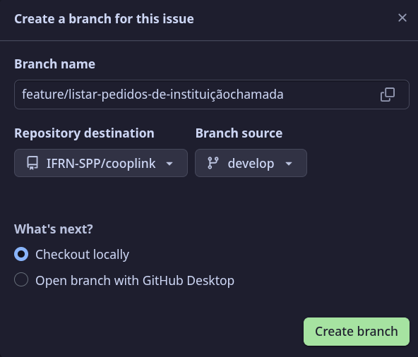

# Guia de Contribuição e Desenvolvimento

O Cooplink é open source e toda contribuição é bem vinda!

Para contribuir com o projeto, caso não tenha acesso ao repositório, crie um fork do repositório. Leia as próximas seções para saber como processeguir.

- [Desenvolvimento Baseado em Tronco](#desenvolvimento-baseado-em-tronco): sobre branches de desenvolvimento para as issues.

- [Commits Convencionais](#commits-convencionais): padrão de commits para o projeto.

- [Criando Branches e Commits](#criando-branches-e-commits): como criar branches e commits para o projeto.


- [Pull Requests](#criando-branches-e-commits): sobre os Pull Requests do projeto.

## Desenvolvimento Baseado em Tronco

O desenvolvimento baseado em tronco (*trunk based development*) é um modelo de controle de versões, focado no desenvolvimento de pequenas modificações no "tronco" (main). Esse modelo é essencial para [integração contínua](https://www.atlassian.com/br/continuous-delivery/continuous-integration) e é padrão para equipes de engenharia de alto desempenho.

[Documentação do Atlassian sobre Trunk Based](https://www.atlassian.com/br/continuous-delivery/continuous-integration/trunk-based-development).

[Vídeo da Alura](https://youtu.be/0jw8RpHuZ-Q?si=QggUY1vjaZTOE8Ob) sobre Git Flow x Trunk Based Development.

Nesse modelo, os *Hotfixes* são implementados direto no branch principal `main`. A versão de desenvolvimento geral é o branch `develop` e as correções e implementações são desenvolvidas nos branches `feature`, esse é relacionado a uma `issue`.

Quando um `feature` é completado, ele é implementado no `develop`, que posteriormente é integrado ao `main`, assim criando uma nova versão do projeto.

Exemplo de Ramificação:


<p style="text-align: center; font-size: 12px">Imagem criada por: <a href="https://github.com/dvanael">Ana Barbosa<a/></p>

## Commits Convencionais
Uma forma de padronizar os commits. Essa é uma convenção simples para as mensagens de commits. O foco dela é criar um histórico de commit de entendimento fácil.

[Documentação do Conventinal Commits](https://www.conventionalcommits.org/pt-br/v1.0.0/).

[Vídeo da Rocketseat](https://youtu.be/sStBPj7JJpM?si=1RNf3OgUoZOoDGBD) sobre Conventinal Commits.

Vamos utilizar uma versão mais simples de padronização para evitar complicações e dúvidas para só fazer um commit.

## Criando Branches e Commits

### Padronização

Os títulos de commits e branches deve ser estruturados da seguinte forma:

- `<tipo> <descrição>`

Exemplo de Commit:

```html
<!-- <tipo>: <descrição> -->
feat: adiciona Create de Produtos
<!-- <corpo> -->
Esse commit adiciona a operação create
para o objeto Produto no sistema.
```

Exemplo de Branches:

```html
<!-- <tipo>/<descrição> -->
feature/adiciona-crud-de-produtos
```
> Preferencialmente, o nome dos branches devem ser com hífem e lowercase, sem espaço.

---

### Tipos
Esses tipos são baseados nos tipos de commit do [Angular Convention](https://github.com/angular/angular/blob/22b96b9/CONTRIBUTING.md#type).

- `feat`, `feature`: Uma nova funcionalidade/recurso;

- `fix`, `bugfix`: Um bug consertado;

- `docs`: Apenas mudanças na documentação (README.md,  etc);

- `perf`: Um código que melhora a performance do sistema;

- `refactor`: Uma alteração de código que não corrige um bug nem adiciona um recurso/funcionalidade

- `style`: Mudanças que não afetam o funcionamento do código (formatação, falta de vírgulas, linha em branco);

> `style` NÃO é para Frontend! Se você adiciona ou corrige algo no front é um `feat` ou `fix`

---

### Descrição

Na descrição deve ser escrita de forma que complete a seguinte frase:

- *Se eu adicionar esse commit/branch ele...*

  - `feat: adiciona paginação para a listagem de Produtos`

Exemplos:

Commit: `fix: corrige permissões na página inicial`

Branch: `bugfix/corrige-permissoes-de-usuario`

---

### Corpo

Dependendo do commit, apenas sua **Descrição** não é suficiente e auto explicativa. O corpo deve conter o que o commit faz e a motivação pra essa alteração, se necessário.

Exemplo:

```
fix: corrige falha na pesquisa de Usuários (Closes #3)

Esse commit adiciona na função `user_list` uma variável
que busca na URL os parâmetros de pesquisa, o que faltava
anteriormente.  Issue #3
```

---

### Issues

Para Branches, crie um branch para resolver a issue.

Nomeie a brach descrevendo o que será implementado ou alterado, seguindo o padrão de [Descrição](#descrição).




No seu repositorio local, faça um `git fetch origin` e `git checkout` no branch.

Veja [como criar um brach para problemas](https://docs.github.com/pt/issues/tracking-your-work-with-issues/using-issues/creating-a-branch-for-an-issue).

---

Para os Commits, coloque o `#número-da-issue` no fim da Descrição do commit entre parênteses, assim você faz referência ao commit na issue.

Exemplo:

- `feat: adiciona função para calcular área (#2)`

Quando seu último commit **resolve o problema da Issue**, adicione no final da descrição `Closes`  com o número da issue para fechá-la.

Exemplo de Issue:

- `fix: corrige falha na pesquisa de Usuários (Closes #3)`

Caso você esqueça, é posivel fechar a issue pelo painel do Github.

---

## Pull Requests

Quando seus problemas forem resolvidos (por você mesmo), conferidos e fechados, está na hora de criar um PR **(Pull Request)**.

No painel do Github, crie um Pull Request da sua `feature`, `bugfix`, etc, para o branch `develop`.

Na descrição, diga tudo que foi alterado ou implementado no seu branch, cite issues, mudanças importantes e entre outros.

Atribua você mesmo  (*assign yourself*) ao PR, e pessoas que te ajudaram, marque alguém para dar *review* no seu PR, marque as labels e entre outros.

Com tudo preenchido, crie o PR. Caso tenha esquecido algo, é possivel editar (antes que ele seja fechado).

Branches para resolver problemas devem ser deletados após o merge com `develop`. É possível restaurar o branch, caso aja necessidade de adicionar mais alterações.

---

## Dúvidas

Dúvidas sobre **Git**? Acesse o [minicurso de Git do Prof. Diego Cirilo](https://dvcirilo-ifrn.github.io/minicursos/).