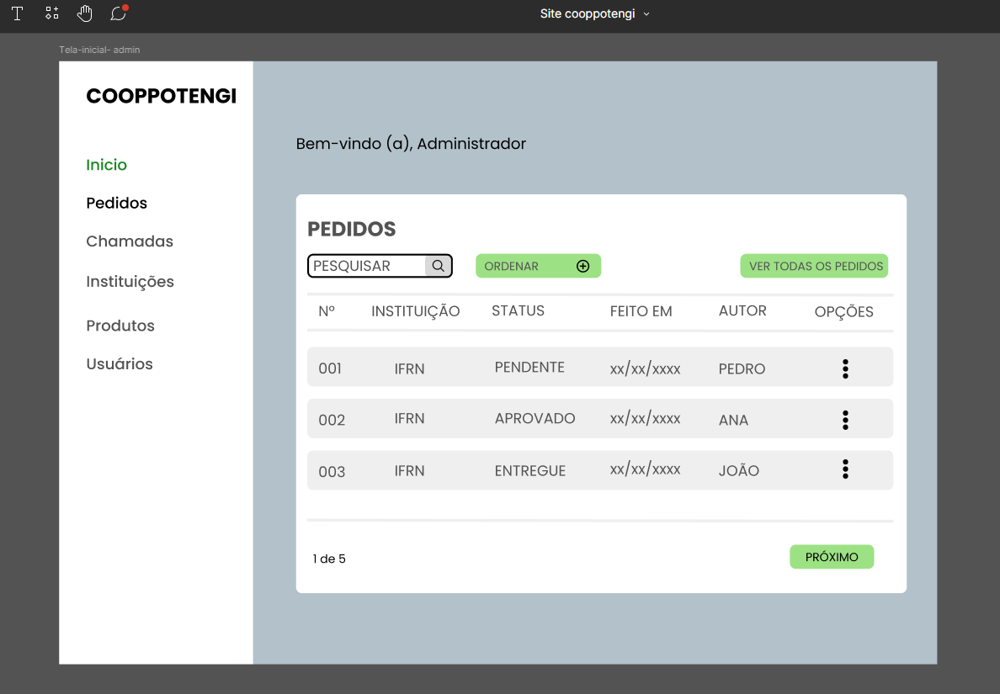
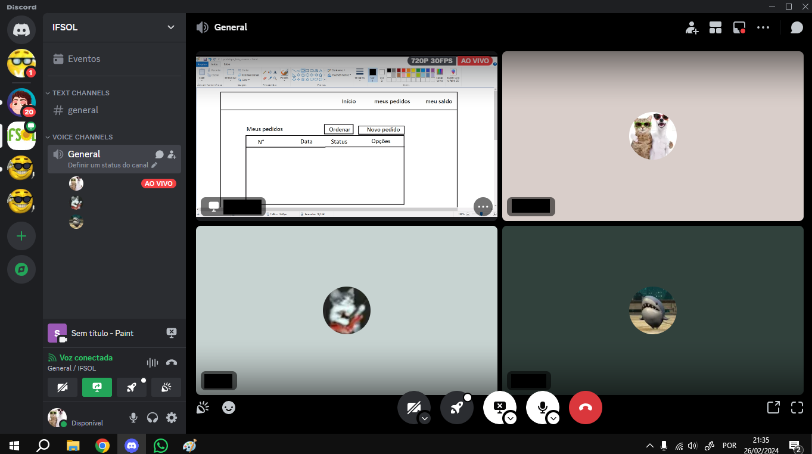
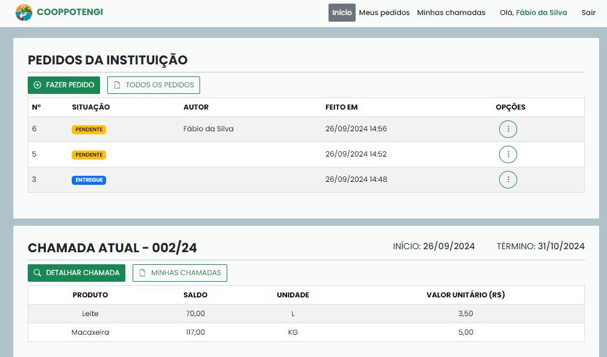
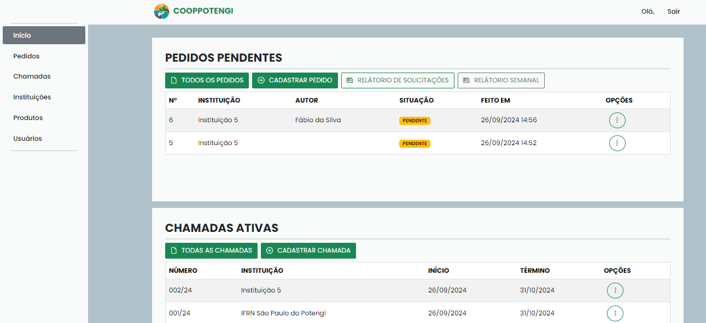
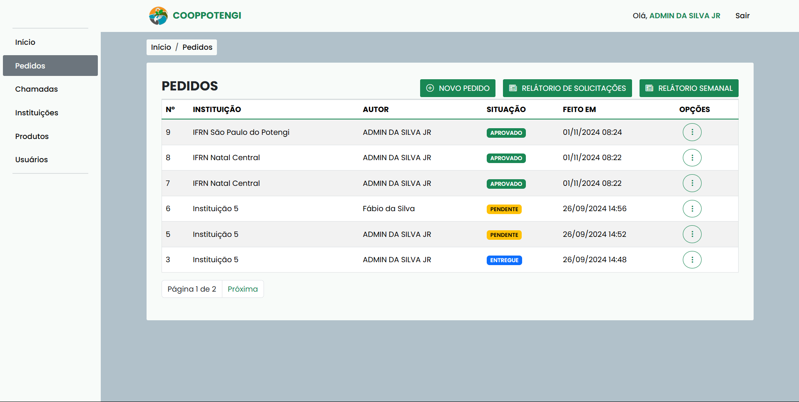

<section align="center">

INSTITUTO FEDERAL DE EDUCAÇÃO, CIÊNCIA E TECNOLOGIA DO RIO GRANDE DO NORTE 

IV EXPOTEC Potengi Sustentável: juntos pela Agenda 2030 

<h1>SISTEMA ORGANIZACIONAL PARA A COOPERATIVA DE AGRICULTURA FAMILIAR DA REGIÃO POTENGI</h1>
</section>

**Modalidade:** Comunicação Oral.

**Eixo Temático:** Ciências Exatas e da Terra.

João Anael Barbosa Silva  
Maria Poliana Pinheiro de Paiva  
Wenderson da Silva Nascimento  
Diego Vinicius Cirilo do Nascimento  
Fernanda Ligia Rodrigues Lopes

**Resumo:** Este artigo apresenta parte do processo de criação de um sistema web corporativo desenvolvido para a Cooperativa de Agricultura Familiar e Economia Solidária da região Potengi (Cooppotengi). O sistema foi criado para otimizar a administração da cooperativa, que anteriormente gerenciava seus processos de forma manual. A solução consiste em um site com funcionalidades baseadas nas necessidades identificadas junto aos representantes da cooperativa, incluindo a criação de telas interativas e a programação do sistema. Foram realizados testes de usabilidade com os representantes para validar o sistema, que agora está disponível online para uso da Cooppotengi.

**Palavras-chave:** Sistema Web, Programação, Economia Solidária, Cooperativa.

---

## 1 INTRODUÇÃO
A economia solidária, conforme Singer (2002), é um modelo que prioriza a colaboração, solidariedade e justiça social nas relações de trabalho, promovendo a divisão equitativa dos lucros entre todos os envolvidos, em vez de focar apenas no lucro individual e na competição. Esse modelo está alinhado com os Objetivos de Desenvolvimento Sustentável (ODS), especialmente o objetivo 1 (erradicação da pobreza) e o objetivo 2 (fome zero e agricultura sustentável), buscando reduzir desigualdades sociais.

Nesse contexto, a Cooperativa de Agricultura Familiar e Economia Solidária da região Potengi (Cooppotengi) atua fortalecendo a agricultura familiar por meio da comercialização de produtos agrícolas e facilitando o acesso à renda para agricultores locais. Suas atividades dialogam diretamente com a meta 2.3 do objetivo 2 das ODS, que visa promover uma agricultura sustentável. Segundo a Organização das Nações Unidas (ONU):

> Até 2030, dobrar a produtividade agrícola e a renda dos pequenos produtores de alimentos, particularmente das mulheres, povos indígenas, agricultores familiares, pastores e pescadores, inclusive por meio de acesso seguro e igual à terra, outros recursos produtivos e insumos, conhecimento, serviços financeiros, mercados e oportunidades de agregação de valor e de emprego não agrícola.

No caso da Cooppotengi, havia dificuldades no controle de estoque e pedidos, que eram realizados manualmente por meio de WhatsApp e e-mail, dificultando a gestão e organização das demandas dos clientes. Para solucionar esse problema, foi desenvolvida uma aplicação web para gerenciar pedidos e gerar relatórios semanais, automatizando processos antes realizados com papel, caneta e planilhas digitais. Com essa automação, a cooperativa passa a ter maior eficiência na administração dos produtos e pedidos.

O desenvolvimento de aplicações web permite abstrair problemas do mundo real e modelar soluções digitais, reduzindo custos e otimizando processos. Assim, o sistema criado para a cooperativa visa automatizar tarefas manuais, como a geração de relatórios, contribuindo para uma gestão mais eficiente.

---

## 2 REFERENCIAL TEÓRICO

### 2.1 Economia Solidária

Segundo Singer (2002), a economia solidária busca criar uma sociedade equitativa, onde prevalece o cooperativismo e a solidariedade em detrimento da competição e do individualismo. Dentro da economia solidária, a propriedade dos meios de produção está nas mãos dos trabalhadores, ou seja, o controle do capital pertence aos trabalhadores e é distribuído entre eles de forma igual, ao contrário da lógica capitalista, onde o controle fica em posse dos detentores dos meios de produção, e a distribuição é desigual.

> O capital da empresa solidária é possuído pelos que nela trabalham e apenas por eles. Trabalho e capital estão fundidos porque todos os que trabalham são proprietários da empresa e não há proprietários que não trabalhem na empresa. E a propriedade da empresa é dividida por igual entre todos os trabalhadores, para que todos tenham o mesmo poder de decisão sobre ela. Empresas solidárias são, em geral, administradas por sócios eleitos para a função e que se pautam pelas diretrizes aprovadas em assembléias gerais ou, quando a empresa é grande demais, em conselhos de delegados eleitos por todos os trabalhadores. (SINGER, 2002, p.4)

### 2.2 Agricultura Familiar

A agricultura familiar consiste em um sistema de produção simplificado, comumente adotado por pequenas propriedades rurais, onde o sustento, a moradia e a sobrevivência da família dependem do uso correto da terra. Não é uma atividade recente, mas vem se destacando, devido a sua expansão e capacidade produtiva (GARCIA e LIMA, [2022], p.8).

No âmbito da economia solidária, a agricultura familiar torna-se um meio de oportunidades de trabalho e renda. O exercício da economia solidária implica numa experiência sustentável pois atua em diversas dimensões como: econômica, ambiental e social. Isso contribui para ampliar as oportunidades de emprego e renda visto que, segundo Garcia ([2022]), se configura em redes de cooperação econômica, gerando, assim, uma alternativa forte e sustentável.

### 2.3 Framework Django

Para o desenvolvimento da aplicação, foi utilizado o framework Django. Framework é um grupo de ferramentas prontas usado para uma atividade. No contexto do desenvolvimento web, dentre outros frameworks, existe o Django (criado com a linguagem de programação Python) com diversas funcionalidades pré-estabelecidas usadas para facilitar a criação da parte lógica de um site.

### 2.4 VSCode

Para a criação do código-fonte do sistema, foi utilizado o aplicativo VSCode. Essa aplicação é um poderoso ambiente de desenvolvimento, que possui suporte para várias linguagens de programação, incluindo HTML, CSS, JavaScript e Python. Com isso, a programação se torna mais rápida e prática.

### 2.5 Github

Para o versionamento do código e desenvolvimento paralelo entre os membros da equipe, foi utilizado a plataforma Github. Essa plataforma permite a disponibilização do código de forma online. Também há interação com o Git (sistema para versionamento de código), assim a equipe de desenvolvimento pode trabalhar paralelamente em diferentes funcionalidades, sem interferir nos códigos e funcionalidades criados pelos seus colegas.

### 2.6 Figma

Para criar os protótipos das telas do sistema, foi utilizado o aplicativo Figma. Essa aplicação possui diversas funcionalidades voltadas para a criação de design de telas e, além disso, permite a colaboração da equipe, pois é possível compartilhar a criação de um design com outras pessoas.

---

## 3 METODOLOGIA

O desenvolvimento do sistema se deu nas seguintes etapas: (I) reuniões com representantes da cooperativa, (II) levantamento de requisitos (para entender quais funcionalidades seriam colocadas no sistema), (III) prototipação de telas, (IV) programação, (V) implantação, (VI) reuniões com a equipe de desenvolvimento e (VII) testes.

Regularmente, foram feitas reuniões com os representantes da Cooppotengi, que descreveram como administravam os pedidos. As reuniões serviram para a equipe fazer o levantamento dos requisitos do sistema. Nessas reuniões, foram apresentados à equipe de desenvolvimento os processos manuais de gerenciamento da cooperativa, as formas como aconteciam esses processos e os formulários e planilhas utilizadas neles. Assim, foi possível evitar conflitos de usabilidade na transição do processo manual para o sistema web.

Posteriormente, foi realizada a criação de protótipos de telas interativas no Figma (aplicativo para criação de design), utilizadas para a validação das funcionalidades elaboradas nas reuniões. Com os protótipos das telas, foi possível entender como os elementos de interação do sistema ficariam dispostos, o que ajudou também a entender como ficaria a programação por debaixo das telas.

Figura 1. Protótipo de tela da página inicial do módulo administrativo.

Fonte: Elaboração própria, 2024.

A programação do sistema foi realizada no VSCode (aplicativo editor de códigos), utilizando o Django. A escolha do Django se deu porque esse framework foi projetado para facilitar e acelerar tarefas no desenvolvimento web (Django, 2005). O código-fonte foi versionado no GitHub (site que armazena códigos de programação), facilitando o controle das versões do sistema e na colaboração entre os membros da equipe.

Reuniões assíncronas e síncronas foram realizadas pela equipe, visando manter a produtividade e conexão entre os membros. O Discord (aplicativo de comunicação por voz e vídeo) foi usado para esses encontros.

Figura 2. Reunião online no Discord para discussão de ideias.

Fonte: Imagem do autor, 2024.

Durante o desenvolvimento, a equipe foi dividida em grupos para o criação do backend e frontend simultaneamente. Os protótipos de telas criados anteriormente, serviram de base para elaboração de templates estáticos, criados com HTML, CSS, JavaScript, Bootstrap (framework CSS) e jQuery (biblioteca JavaScript). Simultaneamente, as funcionalidades do sistema foram programadas em Python. Após desenvolvimento significativo de ambas as partes, ambos foram unidos compondo um sistema completo com interface dinâmica.

Para a implantação do sistema, foi usado o Pythonanywhere (plataforma para a implantação de sistemas Python) para a disponibilização online do sistema. Juntamente, um banco de dados robusto para o armazenamento dos dados se mostrava necessário, logo o MySQL (um sistema de gerenciamento de bancos de dados relacional) foi usado com essa finalidade na implantação.

Testes foram realizados para garantir o bom funcionamento e usabilidade do sistema. Após a conclusão dos testes pela equipe de desenvolvimento, o sistema foi implantado online para testes na cooperativa, acompanhado de vídeos tutoriais para o treinamento da equipe da Cooppotengi. Com isso, foi planejado a manutenção e o suporte contínuo para assegurar que o sistema atenda às necessidades da cooperativa, realizando atualizações periódicas em suas funcionalidades. Dessa forma, contribuindo para o crescimento do cooperativismo e da agricultura familiar na região Potengi.

---
## 4 RESULTADOS E DISCUSSÕES

A implementação do sistema web para a cooperativa exigiu não apenas boas práticas de programação, mas também uma interface intuitiva, ágil e objetiva. Desde a primeira reunião com a equipe gestora da Cooppotengi, o levantamento detalhado dos requisitos foi fundamental para o sucesso do projeto.

A elaboração de artefatos técnicos, como diagramas, protótipos de telas e modelagem do banco de dados, permitiu à equipe técnica propor soluções práticas e eficientes, promovendo a automação dos processos e minimizando a ocorrência de erros. Esse processo possibilitou o mapeamento das principais regras de negócio, que orientam o funcionamento do sistema conforme as necessidades da cooperativa. A seguir, estão listadas as principais regras de negócio implementadas:

| Regra de Negócio | Descrição|
|------------------------------------------|---------------------------------------------------------------------------------------------|
| Bloquear pedidos aos finais de semana | O sistema impede que usuários realizem pedidos aos sábados e domingos. |
| Controle de pedidos não pendentes | Usuários não podem alterar informações de pedidos que já foram processados. |
| Relatório semanal em formato PDF | O sistema gera automaticamente um relatório com todos os produtos de pedidos aprovados e entregues. |
| Relatório de solicitações em formato PDF | O sistema gera automaticamente um relatório com os pedidos pendentes e aprovados. |
| Termo de recebimento | O sistema gera um termo oficial de confirmação para a Cooppotengi e seus clientes com os produtos entregues. |

Fonte: Elaborada pelo autor, 2024.

Com esse mapeamento, foi possível definir o comportamento do sistema e destacar funcionalidades de acesso rápido nas interfaces dos usuários clientes e administradores.

Figura 3. Página inicial do usuário cliente.

Fonte: imagem do autor, 2024.

Figura 4. Página inicial do usuário administrador.

Fonte: imagem do autor, 2024.

Figura 5. Página de pedidos do usuário administrador.

Fonte: imagem do autor, 2024.

O processo de desenvolvimento envolveu reuniões frequentes e testes periódicos, permitindo identificar e corrigir eventuais equívocos, como o fluxo para realização de pedidos, que exige a inserção prévia de produtos cadastrados pelo administrador. Os testes realizados pela equipe gestora da Cooppotengi também evidenciaram a necessidade de um relatório de solicitações, abrangendo todos os pedidos pendentes e aprovados, o que foi prontamente incorporado ao sistema.

Após esse ciclo de comunicação, desenvolvimento e ajustes contínuos, o sistema encontra-se em fase de testes pela Cooppotengi, demonstrando potencial para atender às demandas específicas da cooperativa. A automação das operações diárias e a geração de relatórios detalhados contribuem para uma gestão mais eficiente de pedidos e estoque, redução de erros e maior facilidade no acompanhamento das atividades. Com esses avanços, a Cooppotengi tende a conquistar uma organização interna mais estruturada, fortalecendo o atendimento aos clientes e promovendo a agricultura familiar e a economia solidária na região Potengi.

---

## 5 CONSIDERAÇÕES FINAIS

Considerando os resultados alcançados, a equipe de desenvolvimento identificou oportunidades de aprimoramento para o sistema, como a implementação de maior responsividade para dispositivos móveis, incluindo tablets e smartphones. Foram discutidas também possíveis melhorias na experiência do usuário e atualizações visuais na interface.

Além disso, novas funcionalidades para o backend foram propostas, com o objetivo de tornar o sistema mais genérico e adaptável. Com essa abordagem, o sistema poderá ser disponibilizado como código aberto para outras cooperativas, ampliando seu impacto e contribuindo ainda mais para o fortalecimento da economia solidária.

---

## REFERÊNCIAS BIBLIOGRÁFICAS

Django, 2005. Django Documentation. Disponível em: https://docs.djangoproject.com/en/5.1/. Acesso em 02 nov. 2024.

LENCINA, W. O que é um framework e para que serve? Disponível em: https://ebaconline.com.br/blog/framework-seo. Acesso em 02 nov. 2024.

FIGMA. Figma: the Collaborative Interface Design tool. Disponível em: https://www.figma.com/.

ONU. Objetivos de Desenvolvimento Sustentável | As Nações Unidas no Brasil. Disponível em: https://brasil.un.org/pt-br/sdgs. Acesso em 31 out. 2024.

Objetivo de Desenvolvimento Sustentável 2: Fome zero e agricultura sustentável | As Nações Unidas no Brasil. Disponível em: https://brasil.un.org/pt-br/sdgs/2. Acesso em 01 nov. 2024.

SINGER, Paul. **A recente ressurreição da economia solidária no Brasil. Produzir para viver: os caminhos da produção não capitalista.** Rio de Janeiro: Civilização Brasileira, v. 2, 2002. Acesso em: 31 out. 2024.

OLIVEIRA, Karina Lima; DE OLIVEIRA, Gilca Garcia. **A AGRICULTURA FAMILIAR NA ECONOMIA SOLIDÁRIA: UMA BREVE ANÁLISE DAS POLÍTICAS PÚBLICAS NA BAHIA.** Acesso em: 31 out. 2024.

VSCODE. Documentation for Visual Studio Code. Disponível em: https://code.visualstudio.com/docs. Acesso em 02 nov. 2024.

Comece seu percurso. GitHub Docs. Disponível em: https://docs.github.com/pt/get-started/start-your-journey. Acesso em: 2 nov. 2024.
