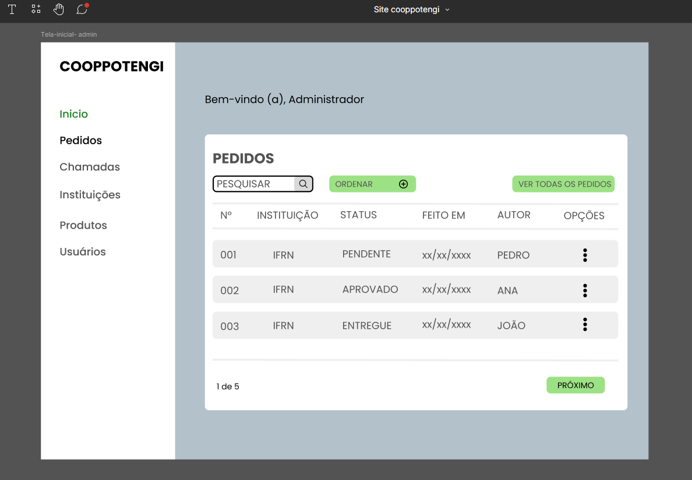
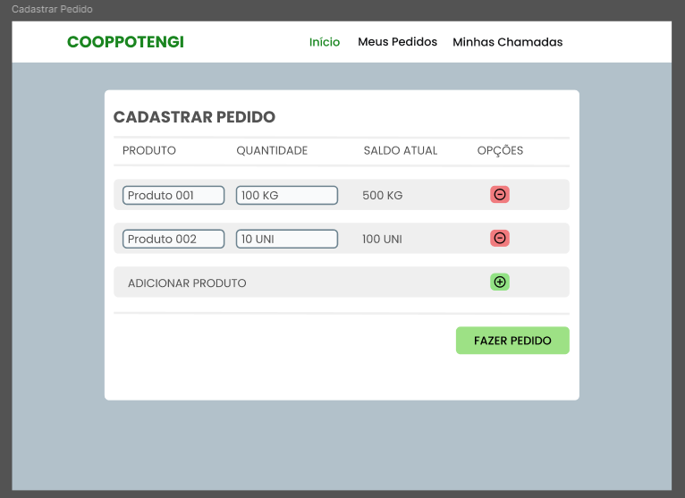
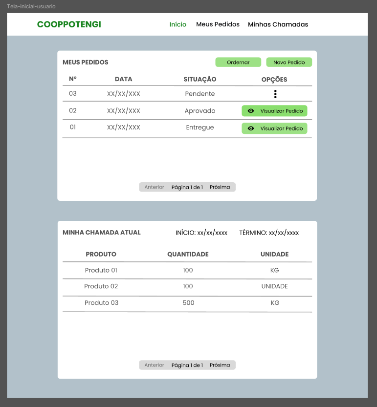
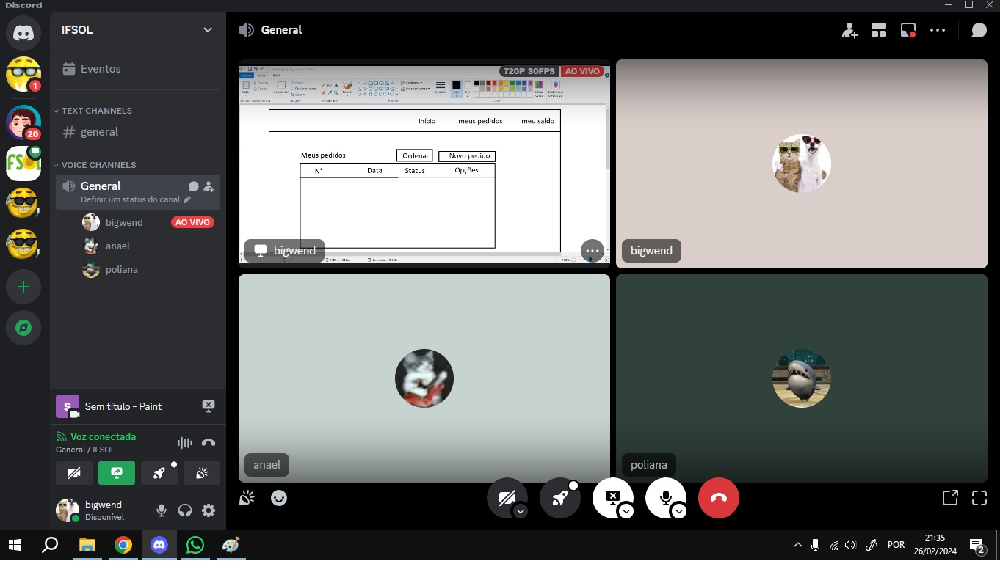
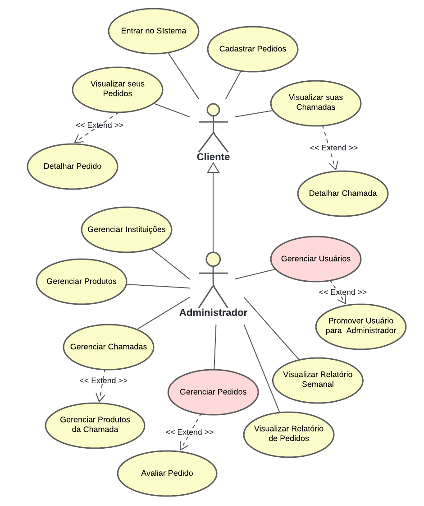
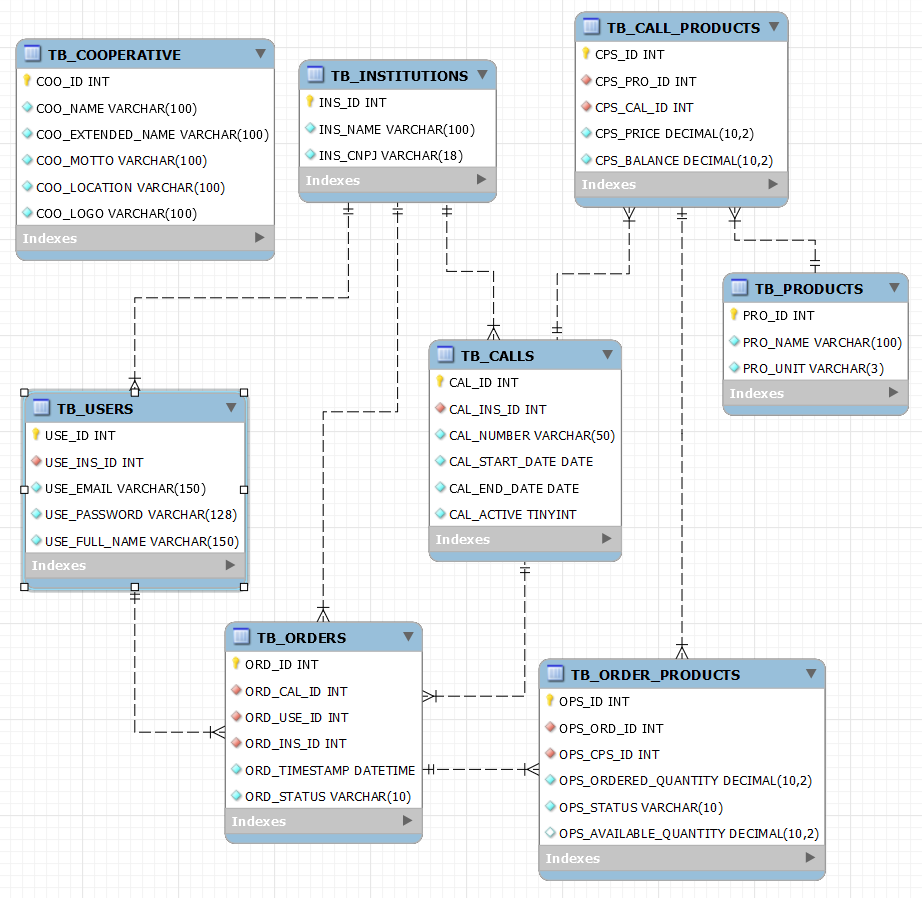
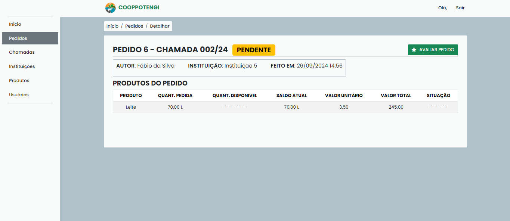
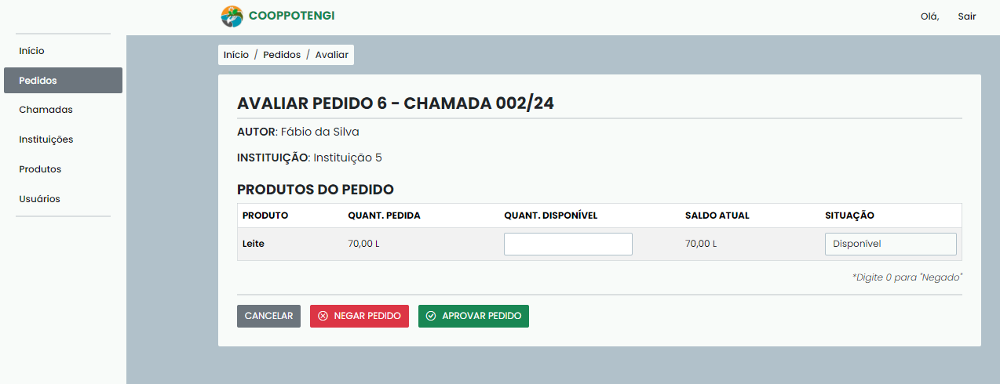
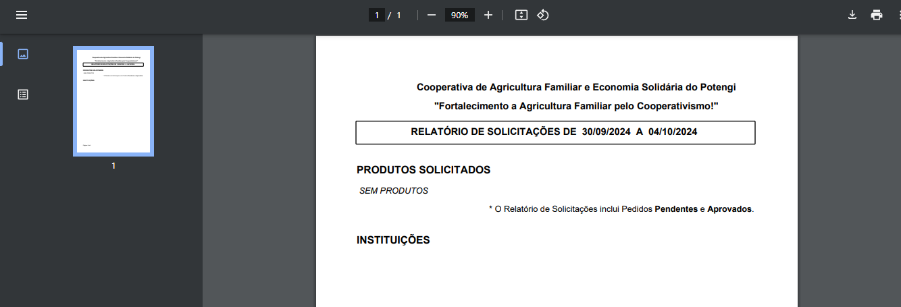
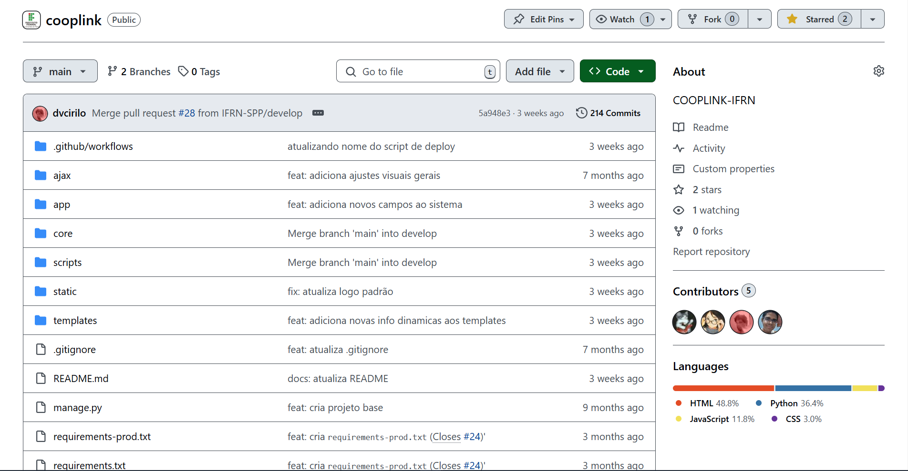

<section align="center">

INSTITUTO FEDERAL DE EDUCAÇÃO, CIÊNCIA E TECNOLOGIA DO RIO GRANDE DO NORTE 

JOÃO ANAEL BARBOSA SILVA  MARIA POLIANA PINHEIRO DE PAIVA 

<h1>COOPLINK: UM SISTEMA ORGANIZACIONAL PARA AS COOPERATIVAS DE AGRICULTURA FAMILIAR (BACKEND)</h1>

SÃO PAULO DO POTENGI, RN  2024

</section>

---

**RESUMO**

A Cooperativa de Agricultura Familiar e Economia Solidária do Potengi desempenha a função de intermediar a comercialização de produtos de pequenos agricultores às instituições de ensino da região Potengi, o que promove a comercialização de produtos agrícolas da agricultura familiar. Entretanto, foi apresentado um problema quanto à administração dos pedidos feitos pelas instituições. Um sistema web foi construído com o objetivo de melhorar a administração dos pedidos feitos pelas instituições. Esse relatório mostra como foi o processo de desenvolvimento e análise das funcionalidades do sistema, descrevendo as técnicas e tecnologias usadas.

**Palavras Chave**: Sistema Web, Internet, Cooperativa.

---

**ABSTRACT**

The Potengi Family Agriculture and Solidarity Economy Cooperative serves as an intermediary for the commercialization of products from small farmers to educational institutions in the Potengi region, promoting the sale of agricultural products from family farming. However, a problem was identified regarding the management of orders made by these institutions. A web system was developed with the goal of improving the administration of orders placed by the institutions. This report outlines the process of development and analysis of the system's features, describing the techniques and technologies used.

**Keywords**: Web System, Internet, Cooperative.

---

**GLOSSÁRIO DE TERMOS**

| Termo | Por extenso |
| --- | --- |
| UML | Unified Modeling Language |
| HTML | HyperText Markup Language |
| CSS | Cascading Style Sheets |
| SQL | Structured Query Language |
| IFRN | Instituto Federal do Rio Grande do Norte |
| SPP | São Paulo do Potengi |

---

**LISTA DE FIGURAS**

| Nùm. | Descrição |
| --- | --- |
| Imagem 01. | Registro fotográfico da reunião para levantamento de requisitos.	|
| Imagem 02. | Protótipo de tela da página inicial do módulo administrativo.	|
| Imagem 03. |  Protótipo de tela da página “Cadastrar Pedido” do módulo cliente.	|
| Imagem 04. | Protótipo de tela da página inicial do módulo cliente.	|
| Imagem 05. | Reunião online no Discord para discussão de ideias.	|
| Imagem 06. | Diagrama de casos de uso.	|
| Imagem 07. | Modelo de banco de dados do sistema.	|
| Imagem 08. | Tela inicial de usuário cliente.	|
| Imagem 09. | Tela de pedidos do usuário administrador.	|
| Imagem 10. | Tela de avaliação de pedidos, somente para administradores.	|
| Imagem 11. | Relatório de Pedidos solicitados em documento PDF gerado pelo sistema.	|
| Imagem 12. | Repositório público do código fonte do sistema.	|

---

**LISTA DE QUADROS**

| Nùm. | Descrição |
| --- | --- |
| Quadro 1. | Lista de requisitos funcionais do sistema. |
| Quadro 2. | Lista de requisitos não funcionais do sistema |

---

**SUMÁRIO**

- [INTRODUÇÃO](#1-introdução)
  - [OBJETIVO](#11-objetivos)
  - [OBJETIVOS ESPECÍFICOS](#12-objetivos-específicos)
  - [METODOLOGIA](#13-metodologia)
- [ANÁLISE E PROJETO](#2-anáise-e-projeto)
  - [VISÃO GERAL DO SISTEMA](#21-visão-geral-do-sistema)
  - [ATORES DO SISTEMA](#22-atores-do-sistema)
  - [LEVANTAMENTO DE REQUISITOS](#23-levantamento-de-requisitos)
    - [Técnicas Utilizadas](#231-técnicas-utilizadas)
    - [Requisitos Funcionais](#232-requisitos-funcionais)
    - [Requisitos Não Funcionais](#233-requisitos-não-funcionais)
  - [DIAGRAMAS DE CASO DE USO](#24-diagramas-de-caso-de-uso)
  - [EXPANSÃO DE CASO DE USO - GERENCIAR USUÁRIOS](#25-expansão-de-caso-de-uso---gerenciar-usuários)
  - [EXPANSÃO DE CASO DE USO - GERENCIAR PEDIDOS](#26-expansão-de-caso-de-uso---gerenciar-pedidos)
  - [MODELO DE DADOS](#26-modelo-de-dados)
- [RESULTADOS](#3-resultados)
- [CONCLUSÃO](#4-conclusão)

[REFERÊNCIAS](#referências)

---

## 1. INTRODUÇÃO
O objetivo deste relatório é documentar a Prática Profissional dos alunos do Curso Técnico Integrado de Informática para Internet, por meio do registro das atividades realizadas no Projeto de Extensão IFSOL. Através deste projeto, foi atribuído aos alunos o desenvolvimento e implantação de uma aplicação web para a cooperativa local que está sob processo de incubação do projeto.

A CoopPotengi, Cooperativa de Agricultura Familiar e Economia Solidária da região Potengi, é uma cooperativa que desempenha o papel de fortalecimento da agricultura familiar, promovendo a comercialização de produtos agrícolas e facilitando o acesso à renda para agricultores familiares, atuando como intermediária, adquirindo produtos dos agricultores locais e fazendo o comércio para instituições da região do Potengi.

Pela cooperativa, foi apresentado o problema de controle de pedidos de produtos feitos por vários meios de comunicação, desde WhastApp até e-mail. Isso dificultava a gestão e organização desses pedidos feitos pelas instituições clientes da CoopPotengi.

Com base na problemática apresentada, foi dada aos alunos como atividade principal o desenvolvimento e implementação de um aplicação web que fosse o meio principal para o gerenciamento de pedidos, assim oferecendo uma oportunidade para aplicação dos conhecimentos teóricos e práticos dos alunos em um contexto real.

Este relatório descreve o desenvolvimento da aplicação web para a CoopPotengi, desde a fase inicial de levantamento e análise de requisitos até a implementação final do sistema.

### 1.1. OBJETIVOS

Desenvolver e implementar uma aplicação web para o controle de pedidos da CoopPotengi, com foco na digitalização dos processos internos de gestão de pedidos, buscando proporcionar maior eficiência e agilidade na interação entre a cooperativa e seus clientes.

### 1.2. OBJETIVOS ESPECÍFICOS

- Fazer reuniões com os representantes da CoopPotengi para o levantamento de requisitos, demonstração dos protótipos iniciais e funcionais para validar as funcionalidades com os representantes da cooperativa;

- Prototipar as telas, identidade visual e funcionalidades do sistema;

- Desenvolver a aplicação web utilizando as tecnologias adequadas, para garantir que o sistema seja robusto, seguro e de fácil usabilidade;

- Realizar testes no sistema, corrigir erros e ajustar funcionalidades para garantir o funcionamento antes da implantação;

- Implantar o sistema e assegurar que a equipe da CoopPotengi seja treinada para utilizá-lo;

- Prover manutenção e suporte contínuo ao sistema após a implantação.

### 1.3. METODOLOGIA
O desenvolvimento da aplicação web foi realizado em várias etapas. Primeiramente, o levantamento de requisitos foi feito inicialmente com reuniões com os representantes da CoopPotengi para identificar e relatar como é feito o processo e gerenciamento dos pedidos. Posteriormente, foi realizada a prototipação das telas no Figma, permitindo a visualização e validação das funcionalidades antes do desenvolvimento.

A programação do sistema foi realizada no VSCode, utilizando o Django como framework de desenvolvimento web. O Django foi escolhido visto que esse framework foi projetado para facilitar e acelerar tarefas no desenvolvimento web (Django, 2005). O código-fonte foi versionado no GitHub, facilitando o controle das versões e a colaboração entre os membros da equipe. Casos de Uso foram diagramados, com base na UML, para levantamento de requisitos. A interface do sistema foi desenvolvida com HTML, CSS, JavaScript, jQuery e Bootstrap. O banco de dados foi modelado com diagramas UML e gerenciado com MySQL.

Durante o desenvolvimento, foram realizados testes fechados com a equipe de desenvolvimento para garantir a funcionalidade e a usabilidade do sistema. Após a conclusão dos testes, o sistema foi implantado para testes abertos da CoopPotengi, acompanhado de vídeos tutoriais para o treinamento da equipe da cooperativa. A manutenção e o suporte contínuo foram planejados para assegurar que o sistema continue a atender às necessidades da CoopPotengi e a contribuir para o crescimento da agricultura familiar na região Potengi.

## 2. ANÁISE E PROJETO

### 2.1. VISÃO GERAL DO SISTEMA

Esse sistema permitirá aos membros da cooperativa o controle dos dos pedidos feitos pelas instituições, o gerenciamento de usuários e instituições clientes,  e permitirá aos clientes da CoopPotengi fazer pedidos para a cooperativa diretamente pelo sistema. Desse modo, sendo divido em dois módulos descritos a seguir:

- **Módulo Cliente:** é utilizado pelos usuários que são registrados no sistema, os usuários clientes, podendo visualizar ao histórico de pedidos e chamadas públicas da sua instituição e fazer pedidos de produtos para a cooperativa.

- **Módulo Administrativo:** é utilizado pelos usuários que são registrados como administradores, estendendo os usuários clientes, podendo gerenciar usuários, instituições, produtos, chamadas públicas e pedidos de produtos, e visualizar relatórios dos pedidos.

### 2.2. ATORES DO SISTEMA

O sistema possui dois atores, conforme descritos abaixo:

**Cliente:** diz respeito aos usuários cadastrados no sistema sem registro administrativo. Eles podem acessar parcialmente o sistema, fazer pedidos de produtos, acessar o histórico de pedidos e chamadas públicas anteriores da sua instituição, editar e deletar seus pedidos pendentes, visualizar com detalhes as chamadas públicas, pedidos da instituição e termos de recebimento dos pedidos.

**Administrador:** diz respeito aos usuários cadastrados no sistema com acesso administrativo. Podendo cadastrar, gerenciar e ver detalhadamente usuários, instituições, produtos, chamadas públicas e pedidos de produtos, visualizar termos de recebimento, relatórios geral e semanal de pedidos, alterar acesso e senhas de usuários.
### 2.3. LEVANTAMENTO DE REQUISITOS

#### 2.3.1. Técnicas Utilizadas

**Reuniões:** Foram realizadas reuniões com os representantes da CoopPotengi com o objetivo de entrevistá-los para entender o fluxo de gerenciamento de pedidos, assim levantando requisitos mais semelhantes com o fluxo atual de trabalho.

Imagem 01. Registro fotográfico da reunião para levantamento de requisitos.

Fonte: Imagem do autor (2024).

**Prototipagem:** Diante das informações passadas pelos membros da cooperativa, foram feitos esboços e protótipos de tela no Figma com o objetivo de validar os requisitos levantados na reunião anterior. Esses protótipos de média fidelidade focam em desenvolver o módulo de usuário cliente e administrativo.

Imagem 02. Protótipo de tela da página inicial do módulo administrativo.

Fonte: Elaboração própria (2024).

Imagem 03.  Protótipo de tela da página “Cadastrar Pedido” do módulo cliente.

Fonte: Elaboração própria (2023).

Imagem 04. Protótipo de tela da página inicial do módulo cliente.

Fonte: Elaboração própria (2024).

**Observação:** Parte do levantamento de requisitos foi feito em reuniões, síncronas online, da equipe buscando entender o papel do usuário e observando a problemática, discutindo e formulando um consenso geral sobre os requisitos.

**Brainstorm:** Em reuniões online no Discord, foram feitas discussões entre a equipe com o objetivo de reunir ideias e identificar requisitos.

Imagem 05. Reunião online no Discord para discussão de ideias.

Fonte: Imagem do autor (2024).

#### 2.3.2. Requisitos Funcionais

Os requisitos funcionais representam as principais funcionalidades que o sistema deve efetuar. Eles são representados pelo Quadro 1.

Quadro 2. Lista de requisitos não funcionais do sistema

| **Código** | **Nome** | **Descrição** | **Categoria** |
| --- | --- | --- | --- |
| RF0001 | Entrar no sistema | O sistema deve permitir aos usuários entrar no sistema (login) para acesso. O usuário deverá informar seu e-mail e senha de registro para realizar seu login. | Alta |
| RF0002 | Cadastrar produtos | O sistema deve permitir aos usuários administradores realizar o cadastro de produtos. Ao clicar em “Cadastrar Produtos”, um formulário para ser preenchido é exibido para o usuário com as informações necessárias como nome e unidade de medida. | Alta |
| RF0003 | Editar produtos | O sistema deve permitir aos usuários administradores editar as informações dos produtos ao clicar na opção “Editar” no produto que deseja modificar. | Média |
| RF0004 | Excluir produtos | O sistema deve permitir aos usuários administradores excluir os produtos ao clicar na opção “Excluir” no produto que deseja deletar. | Média |
| RF0005 | Listar produtos | O sistema deve permitir aos usuários administradores visualizar os produtos cadastrados ao clicar na opção “Produtos" no menu lateral. Ao clicar nessa opção, é exibido ao usuário uma lista dos produtos cadastrados no sistema com suas informações e opções de gerenciamento. | Alta |
| RF0006 | Cadastrar Chamada | O sistema deve permitir que os administradores realizem o cadastro de chamadas. Ao clicar em “Cadastrar Chamada”, será exibido um formulário para preenchimento com as informações necessárias, como número, data de início, data de fim e a opção de ativação. | Alta |
| RF0007 | Editar Chamada | O sistema deve permitir que os administradores editem as informações de uma chamada ao clicar no botão “Editar” correspondente. | Média |
| RF0008 | Excluir Chamada | O sistema deve permitir que os administradores realizem a exclusão da chamada ao clicar no botão “Excluir” correspondente. | Média |
| RF0009 | Listar Chamadas | O sistema deve permitir que os administradores visualizem todas as chamadas ao clicar no botão “Todas as Chamadas”. Já os usuários comuns poderão listar apenas suas próprias chamadas, sejam elas ativas ou não. | Alta |
| RF0010 | Detalhar Chamada | O sistema deve permitir que os administradores visualizem detalhadamente as informações de uma chamada, incluindo os produtos vinculados, ao clicar na opção “Detalhar” no menu lateral. Por outro lado, os usuários comuns poderão visualizar os detalhes apenas de suas próprias chamadas, independentemente de estarem ativas ou inativas. | Média |
| RF0011 | Cadastrar Pedido | O sistema deve permitir que administradores e usuários comuns realizem o cadastro de pedidos. Para administradores, a funcionalidade será acessada por meio do botão “Cadastrar Pedido”, enquanto, para usuários comuns, será disponibilizada pelo botão “Fazer Pedido”. | Alta |
| RF0012 | Editar Pedido | O sistema deve permitir que os administradores e usuários comuns editem as informações de uma chamada ao clicar no botão “Editar” correspondente. Entretanto, o administrador poderá alterar a quantidade de produtos solicitada no pedido. | Média |
| RF0013 | Excluir Pedido | O sistema deve permitir que os administradores e usuários comuns realizem a exclusão do pedido ao clicar no botão “Excluir” correspondente. | Média |
| RF0014 | Listar Pedidos | O sistema deve permitir que os administradores visualizem todos os pedidos ao clicar no botão “Todos os Pedidos”. Já os usuários comuns poderão listar apenas seus próprios pedidos, sejam eles pendentes, aprovados, negados ou entregues. | Alta |
| RF0015 | Detalhar Pedido | O sistema deve permitir que os administradores visualizem detalhadamente as informações de um pedido ao clicar na opção “Detalhar” no menu lateral. Por outro lado, os usuários comuns poderão visualizar os detalhes apenas de seus próprios pedidos, independentemente de estarem pendentes, aprovados, negados ou entregues. | Alta |
| RF0016 | Avaliar Pedido | O sistema deve permitir que os administradores avaliem os pedidos para aprová-los ou negá-los. Além disso, os administradores poderão negar, entregar parcialmente ou entregar totalmente um produto, especificando a quantidade disponível no momento da avaliação. | Alta |
| RF0017 | Cadastrar Instituição | O sistema deve permitir que os administradores realizem o cadastro de instituições. Ao clicar em “Cadastrar Instituição”, será exibido um formulário para preenchimento com as informações necessárias, como nome e CNPJ. | Alta |
| RF0018 | Editar Instituição | O sistema deve permitir que os administradores editem as informações de uma instituição ao clicar no botão “Editar” correspondente. | Média |
| RF0019 | Excluir Instituição | O sistema deve permitir que os administradores realizem a exclusão da instituição ao clicar no botão “Excluir” correspondente. | Média |
| RF0020 | Listar Instituições | O sistema deve permitir que os administradores visualizem todas as instituições cadastradas. | Alta |
| RF0021 | Detalhar Instituição | O sistema deve permitir que os administradores visualizem detalhadamente as informações de uma instituição, incluindo a chamada e o usuário comum/representante vinculados a ela. | Alta |
| RF0022 | Cadastrar Usuário | O sistema deve permitir que os administradores realizem o cadastro de usuários. Ao clicar em “Cadastrar usuário”, será exibido um formulário para preenchimento com as informações necessárias, como e-mail, instituição a qual ele deve ser vinculada, nome completo e senha. | Alta |
| RF0023 | Editar Usuário | O sistema deve permitir que os administradores editem as informações de um usuário ao clicar no botão “Editar” correspondente. Além disso, ele poderá alterar as permissões do usuário e/ou a atividade dele. | Média |
| RF0024 | Excluir Usuário | O sistema deve permitir que os administradores realizem a exclusão do usuário ao clicar no botão “Excluir” correspondente. | Média |
| RF0025 | Listar Usuários | O sistema deve permitir que os administradores visualizem todos os usuários cadastrados. | Alta |
| RF0026 | Gerar Relatório Semanal | O sistema deve gerar automaticamente um relatório contendo os pedidos aprovados e entregues ao clicar no botão “Relatório Semanal”, disponibilizando essa funcionalidade exclusivamente para os administradores. | Alta |
| RF0027 | Gerar Relatório de Solicitações | O sistema deve gerar automaticamente um relatório contendo os pedidos pendentes e aprovados ao clicar no botão “Relatório de Solicitações”, disponibilizando essa funcionalidade exclusivamente para os administradores. | Alta |

#### 2.3.3. Requisitos Não Funcionais

Os requisitos não funcionais estão relacionados às restrições do sistema quanto a sua disponibilidade, desempenho e segurança. Eles são representados pelo Quadro 2, mostrado a seguir.

Quadro 2. Lista de requisitos não funcionais do sistema

| **Código** |  **Descrição** | **Categoria** |
| --- | --- | --- |
| RNF001 Paginação | O sistema deve limitar a quantidade de objetos visualizados por paginação de até sete solicitações por página. | Produto |
| RNF002  Acesso Restrito | O sistema não deverá permitir o acesso de usuários não cadastrados à área restrita do sistema. As funcionalidades do sistema serão dispostas conforme os seguintes níveis de permissão: cliente e administrador. | Produto |
| RNF003  Criptografia de senha | O sistema deverá criptografar as senhas dos usuários utilizando o mecanismo de hashing seguro do Django, garantindo proteção contra ataques e evitando o armazenamento em texto puro. | Produto |
| RNF004  Interface Intuitiva | O sistema deve ter uma interface amigável e intuitiva, com navegação fácil e clara, tanto para usuários iniciantes quanto para experientes. | Produto |
| RNF005  Responsividade | O site do sistema deverá estar responsivo, de modo que se torne de fácil acesso em diversos aparelhos. | Produto |
| RNF006  Bloquear acesso no fim de semana | O site deverá impedir a realização de pedidos nos fins de semana. | Produto |

### 2.4. DIAGRAMAS DE CASO DE USO

O diagrama de casos de uso é empregado para identificar os requisitos, os atores do sistema e suas interações, além de melhorar a comunicação entre o analista e o cliente.

Assim, com base nos requisitos funcionais e nos atores envolvidos neste projeto, foram estabelecidos dez casos de uso, como mostrado na Imagem 0.

Imagem 06. Diagrama de casos de uso.

Fonte: Elaboração própria (2024).

Dois casos de uso foram considerados de maior risco. Sendo estes: Gerenciar Usuários e Gerenciar Pedidos.

### 2.5. EXPANSÃO DE CASO DE USO - GERENCIAR USUÁRIOS

O caso de uso Gerenciar Usuários é um dos casos de maior risco desse sistema. Nessa seção são especificadas as ações que um usuário deve realizar no sistema com objetivo de cadastrar um novo usuário. Apenas usuários administradores podem cadastrar novos usuários.

**2.5.1. Atores**

Administrador.

**2.5.2.Pré-condição**

O usuário deve estar logado no sistema e estar na página “Usuários”.

**2.5.3. Pós-condição**

O sistema exibe o novo usuário no topo da tabela.

**2.5.4. Requisitos funcionais:**

RF022 - Cadastrar Usuário

RF023 - Editar Usuário

RF024 - Excluir Usuário

RF025 - Listar Usuário

**2.5.5. Requisitos não funcionais**

RNF001 - Paginação

RNF002 - Acesso Restrito

RNF004 - Interface Intuitiva

RNF005 - Responsividade

**2.5.6. Fluxos Principal**

- Na página de Usuários, o administrador clica em “Cadastrar Usuário”.
- Sistema apresenta o formulário de Cadastro de Usuário.
- O administrador envia o formulário de cadastro com email, instituição, nome completo e senha do usuário.
- O sistema faz a validação dos dados enviados.
  - Os dados são válidos.
  - Os dados do usuário são cadastrados no banco de dados.
- sistema redireciona o administrador para a lista de usuários e exibe o novo usuário no topo da tabela.

**2.5.7. Fluxos Alternativos**
- 1a. O administrador deseja editar os dados de um usuário existente.
  - O administrador clica em “Opções”, depois em “Editar”, no usuário que deseja editar.
  - O sistema exibe um formulário com nome completo e instituição do usuário.
  - O administrador envia o formulário preenchido com os dados que deseja alterar.
  - O sistema faz a validação dos dados alterados.
- 1b. O administrador deseja alterar a senha de um usuário.
  - O administrador clica em “Opções”, depois em “Alterar Senha”, no usuário que deseja mudar a senha.
  - O sistema exibe uma confirmação de senha do administrador.
  - O administrador coloca sua senha.
  - O sistema exibe um formulário para alterar a senha.
  - O administrador preenche o formulário com a nova senha do usuário.
  - O  sistema faz a validação dos dados.
- 1c. O administrador deseja excluir um usuário existente.
  - O administrador clica em “Opções”, depois em “Excluir”, no usuário que deseja excluir.
  - O sistema exibe uma janela para confirmação.
  - O administrador confirma a exclusão.
  - O sistema apaga os dados do usuário do banco de dados.
- 4a. Campo obrigatório não preenchido ou valor não válido.
  - O sistema informa que os campos obrigatórios devem ser preenchidos corretamente.

### 2.6. EXPANSÃO DE CASO DE USO - GERENCIAR PEDIDOS

O caso de uso Gerenciar Pedido é um dos casos de maior risco desse sistema. Nessa seção são especificadas as ações que um usuário deve realizar no sistema com objetivo de cadastrar um pedido. Usuários clientes e administradores podem cadastrar novos pedidos.

**2.6.1Atores**
Cliente, Administrador.

**Pré-condição**
O usuário deve estar logado no sistema e estar na página “Pedidos”.

**Pós-condição**
O sistema exibe o novo pedido no topo da tabela.

**Requisitos funcionais:**

RF011 - Cadastrar Pedido

RF012 - Editar Pedido

RF013 - Excluir Pedido

RF014 - Listar Pedido

RF015 - Detalhar Pedido

RF016 - Avaliar Pedido

**Requisitos não funcionais**

RNF001 - Paginação

RNF002 - Acesso Restrito

RNF006 - Bloquear acesso no fim de semana

**Fluxo Principal**
- Na página de Pedidos, o administrador clica em “Cadastrar Pedido”.
- O sistema apresenta o formulário de Cadastro de Pedido.
- O usuário envia o formulário de cadastro com produtos pedidos e suas quantidades.
  - O sistema faz a validação dos dados enviados.
  - Os dados são válidos.
- Os dados do pedido são cadastrados no banco de dados.
- O sistema redireciona o administrador para a página “Pedidos” e exibe o novo pedido no topo da tabela.

**Fluxos Alternativos**
- 1a. O administrador deseja avaliar um pedido pendente.
  - O administrador clica em “Opções”, depois em “Avaliar”, no pedido que deseja avaliar.
  - O sistema exibe um formulário para informar a quantidade disponível de cada produto pedido.
  - O usuário preenche as quantidades e envia o formulário.
  - O sistema faz a validação dos dados e altera o status do pedido de “pendente” para “aprovado”.
- 1b. O usuário deseja editar os dados de seus pedidos pendentes.
  - O usuário clica em “Opções”, depois em “Editar”, no pedido pendente que deseja alterar.
  - O sistema exibe um formulário com os produtos pedidos e suas quantidades.
  - O usuário preenche o formulário com os produtos e a quantidade que deseja.
  - O sistema faz a validação dos dados.
- 1c. O administrador deseja excluir um pedido pendente.
  - O usuário clica em “Opções”, depois em “Excluir”, no pedido que deseja excluir.
  - O sistema exibe uma janela para confirmação.
  - O administrador confirma a exclusão.
  - O sistema apaga os dados do pedido do banco de dados.
- 4a. Campo obrigatório não preenchido ou valor não válido.
  - O sistema informa que os campos obrigatórios devem ser preenchidos corretamente.

### 2.6. MODELO DE DADOS

O modelo de banco de dados, na Imagem 0, mostra as relações entre os objetos do sistema. Com esse modelo, foi possível implementar a comunicação entre o banco de dados MySQL e o sistema.

Imagem 07. Modelo de banco de dados do sistema.

Fonte: Elaboração própria (2024).

## 3. RESULTADOS
Com a maioria das funcionalidades implementadas, partimos para testes fechados com a equipe de desenvolvimento. Para isso, colocamos o sistema em um servidor de produção. Utilizamos o Pythonanywhere, um serviço online para a hospedagem de sistemas python, com ele é possível criar sistemas na nuvem rapidamente sem complicações (Pythonanywhere, 2011). Dessa forma, utilizamos o sistema em produção para validação das funcionalidades.

O sistema se mostrou bastante eficiente e simples, com um boa interface e experiência de usuário, suas funcionalidades apresentam segurança e a estrutura necessária para um sistema de gerenciamento. Nas seguintes imagens é possível ver algumas telas do sistema.

Imagem 08. Tela inicial de usuário cliente.

Fonte: elaboração própria (2024).

Imagem 09. Tela de pedidos do usuário administrador.

Fonte: elaboração própria (2024).

Imagem 10. Tela de avaliação de pedidos, somente para administradores.

Fonte: elaboração própria (2024).

Imagem 11. Relatório de Pedidos solicitados em documento PDF gerado pelo sistema.

Fonte: elaboração própria (2024).

Em reuniões da equipe, foi discutido sobre a disponibilização do código para o público geral, visto que com um sistema genérico outras cooperativas podem fazer uso do sistema. O código fonte do sistema foi disponibilizado no Github pela organização IFRN-SPP.

Imagem 12. Repositório público do código fonte do sistema.

Fonte: Imagem do autor (2024).

Após resultados satisfatórios para a equipe, o sistema foi implantado para testes com a CoopPotengi. Com isso, recebemos o feedback necessário para dar suporte e manutenção ao sistema e contribuir cada vez mais com a economia solidária.

## 4. CONCLUSÃO
Durante o desenvolvimento, houve muitos imprevistos acadêmicos, o que dificultou a programação de novas funcionalidades discutidas pela equipe. A responsividade do sistema foi um problema recorrente durante o desenvolvimento, muitas soluções foram propostas, porém nenhuma foi implementada.

Soluções para tornar o sistema mais genérico, como a criação de uma aplicação para gerenciamento de unidades de medidas, e diagramas de análise mais elaborados não foram elaborados por causa desses imprevistos.

O plano da equipe para o projeto, no futuro, além de implementar funcionalidades para tornar o sistema mais genérico e responsivo, esperamos implementar o sistema de forma definitiva, não somente na CoopPotengi, mas também em outras cooperativas dispostas a utilizar o sistema. Dessa forma, buscando um caminho mais profissional para o CoopLink.

## REFERÊNCIAS

(Django, 2005). Django Documentation. Disponível em https://docs.djangoproject.com/. Acesso em 11 de ago. de 2024

(Pythonanywhere, 2011). Host, run, and code Python in the cloud!. Disponível em https://www.pythonanywhere.com/. Acesso em 19 de dez. de 2024
