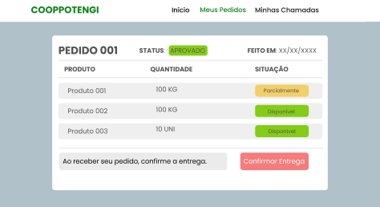
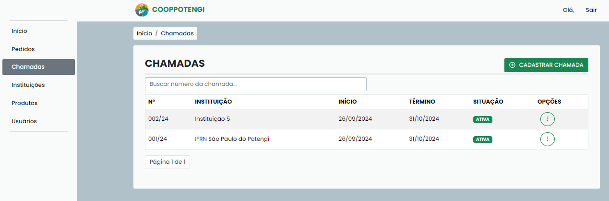

<section align="center">

INSTITUTO FEDERAL DE EDUCAÇÃO, CIÊNCIA E TECNOLOGIA DO RIO GRANDE DO NORTE

WENDERSON DA SILVA NASCIMENTO 

<h1>COOPLINK: UM SISTEMA ORGANIZACIONAL PARA AS COOPERATIVAS DE AGRICULTURA FAMILIAR (FRONTEND)</h1>

SÃO PAULO DO POTENGI, RN   2024 

</section>

---

**RESUMO**

A Cooperativa de Agricultura Familiar e Economia Solidária do Potengi desempenha a função de intermediar a comercialização de produtos de pequenos agricultores às instituições de ensino da região Potengi, o que promove a comercialização de produtos agrícolas da agricultura familiar. Porém foi apresentado um problema quanto à administração dos pedidos feitos pelas instituições. Um sistema web foi construído com o objetivo de melhorar a administração dos pedidos feitos pelas instituições. O presente relatório mostra como foi o processo de criação da interface do sistema, descrevendo as técnicas e tecnologias usadas durante o desenvolvimento do sistema.

**Palavras Chave**: Sistema Web, Interface, Cooperativa.

---

**ABSTRACT**

The Potengi Family Farming and Solidarity Economy Cooperative serves as an intermediary in marketing products from small farmers to educational institutions in the Potengi region, thereby promoting the commercialization of family farming products. However, challenges have arisen in managing orders placed by these institutions. To address this, a web system was developed to enhance order administration. This report details the creation process of the system's interface, describing the techniques and technologies employed during its development.

**Keywords**: Web System, Interface, Cooperative.

---

**GLOSSÁRIO DE TERMOS**

| Termo | Por extenso |
| --- | --- |
| HTML | HyperText Markup Language |
| CSS | Cascading Style Sheets |

---

**LISTA DE FIGURAS**

| Nùm. | Descrição |
| --- | --- |
| Imagem 1 | Protótipo da tela de pedidos do usuário normal |
| Imagem 2 | Protótipo da tela inicial do usuário normal |
| Imagem 3 | Protótipo da tela inicial do usuário administrador |
| Imagem 4 | Tela de início (cliente) |
| Imagem 5 | Tela de pedidos (cliente) |
| Imagem 6 | Tela de chamadas (cliente) |
| Imagem 7 | Tela de início (administrador) |
| Imagem 9 | Tela de pedidos (administrador) |
| Imagem 10 | Tela de detalhes de pedidos (administrador) |
| Imagem 11 | Tela de início avaliação de pedidos (administrador) |
| Imagem 12 | Tela de chamadas (administrador) |
| Imagem 13 | Tela de cadastro de chamada (administrador) |
| Imagem 14 | Tela de edição de chamada (administrador) |
| Imagem 15 | Tela de edição de produtos da chamada (administrador) |
| Imagem 16 | Tela de alterar situação da chamada (administrador) |
| Imagem 17 | Tela de detalhes da chamada (administrador) |
| Imagem 18 | Tela de excluir chamada (administrador) |
| Imagem 19 | Tela de instituições (administrador) |
| Imagem 20 | Tela de cadastrar instituição (administrador) |
| Imagem 21 | Tela de editar instituição (administrador) |
| Imagem 22 | Tela de detalhes da instituição (administrador) |
| Imagem 23 | Tela de excluir instituição (administrador) |
| Imagem 24 | Tela de produtos (administrador) |
| Imagem 25 | Tela de cadastrar produtos (administrador) |
| Imagem 26 | Tela de editar produto (administrador) |
| Imagem 27 | Tela de excluir produto (administrador) |
| Imagem 28 | Tela de usuários (administrador) |
| Imagem 29 | Tela de cadastrar usuário (administrador) |
| Imagem 30 | Tela de editar usuário (administrador) |
| Imagem 31 | Tela de alterar permissão do usuário (administrador) |
| Imagem 32 | Tela de alterar atividade do usuário (administrador) |
| Imagem 33 | Tela de mudar senha de usuário (administrador) |
| Imagem 34 | Tela de excluir usuário (administrador) |
| Imagem 35 | Tela do relatório de solicitações (administrador) |
| Imagem 36 | Tela do relatório semanal (administrador) |

---

**SUMÁRIO**

- [INTRODUÇÃO](#1-introdução)
- [METODOLOGIA](#2-metodologia)
  - [TECNOLOGIAS](#21-objetivos)
  - [PROCESSOS UTIIZADOS](#22-processos-utilizados)
    - [Prototipagem](#221-prototipagem)
    - [Heurísticas de Nielsen](#222-heurísticas-de-nielsen)
- [ANÁLISE E PROJETO](#3-anáise-e-projeto)
  - [VISÃO GERAL DO SISTEMA](#31-visão-geral-do-sistema)
  - [ATORES DO SISTEMA](#32-atores-do-sistema)
  - [TELAS DE CLIENTE](#33-telas-de-cliente)
  - [TELAS DE ADMINISTRADOR](#34-telas-de-administrador)
- [CONCLUSÃO](#4-conclusão)

[REFERÊNCIAS](#referências)

---

## 1. INTRODUÇÃO

Esse relatório descreve a trajetória da construção da interface do sistema de gerenciamento de pedidos de produtos da Cooperativa e Agricultura Familiar e Economia Solidária do Potengi (Cooppotengi), que desempenha a função de intermediar a distribuição de produtos de pequenos agricultores às instituições de ensino da região Potengi, o que promove a comercialização de produtos agrícolas da agricultura familiar.

Pela cooperativa, foi apresentado um problema quanto à administração dos pedidos feitos pelas instituições, que são feitos através de e-mails e mensagens do WhatsApp. O fluxo de atividade da Cooppotengi é muito massivo, pois todo o controle de estoque, controle de entradas e saídas de produtos são feitos manualmente através de planilhas e documentos impressos. O sistema surgiu com o objetivo de melhorar a administração dos pedidos de produtos. E para a criação do sistema é necessário criar uma interface para que os usuários possam utilizá-lo.

O presente relatório descreve como se deu o processo de criação da interface do software, mostrando as técnicas e tecnologias usadas durante o desenvolvimento do sistema.

## 2. METODOLOGIA

Neste tópico, serão contextualizados a metodologia adotada para a produção da interface, as tecnologias utilizadas e as justificativas por trás do design adotado.

### 2.1. TECNOLOGIAS

**2.1.1. Figma**

Segundo a documentação oficial, Figma é uma ferramenta web que permite que as pessoas criem o design de interfaces de forma colaborativa em equipe. Esse aplicativo foi utilizado para construir os protótipos das telas do sistema.

**2.1.2. JavaScript**

De acordo com a Rede de Desenvolvedores da Mozilla (MDN), JavaScript é uma linguagem de programação utilizada para deixar a página interativa para o usuário. Como, por exemplo, fazer um menu lateral aparecer quando clicar em um botão. Essa linguagem foi usada para criar a interatividade das páginas com o usuário do sistema.

**2.1.3. HTML**

Segundo a MDN, HTML é uma linguagem de marcação de hipertexto usada para estruturar os textos de uma página web.

**2.1.4. CSS**

Em conformidade com a MDN, CSS é uma linguagem de estilo usada para descrever o estilo visual das páginas web. Ela foi usada para aplicar o visual criado no figma nas páginas estruturadas no HTML.

**2.1.5. Bootstrap**

Segundo a documentação oficial da ferramenta, Bootstrap é um framework usado para construir páginas rapidamente através de códigos prontos para o uso. Esse framework foi usado para agilizar a construção das páginas. A motivação para seu uso está na facilidade de usar.

**2.1.6. Git/Github**

Conforme o GitHub Docs, Git e Github são, respectivamente, um sistema de gerenciamento do controle de versões de arquivos e um sistema de hospedagem de arquivos. Ambos foram usados para armazenar os códigos das telas do site quando estavam em processo de construção.

**2.1.7. Visual Studio Code (VSCode)**

Segundo o site oficial do Visual Studio Code, VSCode é um editor de texto voltado para a criação de código-fonte de softwares. Ele foi usado para construir as telas do sistema usando HTML, JavaScript e CSS.

### 2.2. PROCESSOS UTILIZADOS

Para a construção da interface foram feitas reuniões com a equipe da cooperativa, a fim de entender bem o problema, e foram utilizadas a técnica da prototipagem, para a criação de protótipos de telas, e as heurísticas de Nielsen, para criar telas de fácil interação para os usuários.

Antes de iniciar a prototipagem, foram feitas reuniões, onde a cooperativa explicou suas regras de negócios e o fluxo de atividades para tratar os pedidos feitos pelas instituições. Com as explicações dadas pelos representantes da cooperativa, foram criados os primeiros protótipos de telas, de forma a espelhar o fluxo de atividades deles e suas regras de negócios.

Depois dos protótipos feitos, foram mostrados a equipe da cooppotengi, que deu o feedback da experiência de usar as telas. Com os pontos levantados pela a experiência de uso da equipe, foram feitas modificações nos protótipos e deu-se início a implementação das telas no código.

#### 2.2.1. Prototipagem

Conforme a revista Quero, a prototipagem é um processo de criação de protótipos que servem de base para o produto final. Através da prototipagem, foi possível construir as telas a partir de rascunhos feitos também no figma. Esses rascunhos, mostrados abaixo, tomaram aparências um pouco diferentes das desenhadas quando as telas foram passadas para o código.

Imagem 1 - Protótipo da tela de pedidos do usuário normal.

Fonte: Elaboração própria, 2024.

Imagem 2 - Protótipo da tela inicial do usuário normal.

Fonte: Elaboração própria, 2024.

Imagem 3 - Protótipo da tela inicial do usuário administrador.

Fonte: Elaboração própria, 2024.

#### 2.2.2. Heurísticas de Nielsen

Segundo Da Cruz et al. (2015), a análise heurística é uma técnica importante para a avaliação da usabilidade de uma tela. Consiste em submeter a interface de um determinado sistema à avaliação de um conjunto de boas práticas de usabilidade determinadas por especialistas na área. E um dos principais especialistas é Jacob Nielsen.

Portanto, ao construir uma interface é importante ter em mente que o usuário precisa de praticidade e intuitividade quando estiver usando o sistema. Logo, as heurísticas de Nielsen entram no processo para nortear a criação de telas intuitivas, que permitam aos usuários uma navegação fluida dentro da aplicação. As heurísticas são separadas em dez, são elas: (I) Visibilidade do status do sistema; (II) Compatibilidade entre o sistema e o mundo real; (III) Controle e liberdade para o usuário; (IV) Consistência e padronização; (V) Prevenção de erros; (VI) Reconhecimento em vez de memorização; (VII) Eficiência e flexibilidade de uso; (VIII) Estética e design minimalista; (IX) Reconhecimento, diagnóstico e recuperação de erros; (X) Ajuda e documentação.

## 3. ANÁLISE E PROJETO

Nesse tópico, está uma visão geral do sistema e as telas finais da interface.

### 3.1. VISÃO GERAL DO SISTEMA

As telas do sistema foram projetadas seguindo as necessidades do cenário descrito pela cooperativa. E dentro desse cenário, existem níveis de permissões de acesso por parte dos usuários do sistema, sendo dividido da seguinte forma:

- **Módulo cliente:** diz respeito aos usuários cadastrados que têm permissões limitadas a fazer pedidos e visualizar o histórico de pedidos feitos e as chamadas públicas ligadas à sua instituição.
- **Módulo administrador:** diz respeito aos usuários com acesso total ao sistema, podendo, gerenciar as chamadas, instituições, usuários, pedidos, produtos e gerar relatórios.

### 3.2. ATORES DO SISTEMA

O sistema possui dois tipos de usuários:

- **Cliente:** é o usuário cadastrado no sistema sem acesso de administrador e pode fazer, atualizar e deletar pedidos; e visualizar as chamadas ligadas à sua instituição.

- **Administrador:** é o usuário com todas as permissões do sistema.

### 3.3. TELAS DE CLIENTE

A seguir, são apresentadas as telas finais do módulo usuário, após a prototipação e implementação do sistema.

Imagem 4 - Tela de início (cliente).

Fonte: Elaboração própria, 2024.

Imagem 5 - Tela de pedidos (cliente).

Fonte: Elaboração própria, 2024.

Imagem 6 - Tela de chamadas (cliente).

Fonte: Elaboração própria, 2024.

### 3.4. TELAS DE ADMINISTRADOR

Abaixo, seguem as telas finais do módulo administrador após todo o processo de prototipação e implementação do software.

Imagem 7 - Tela de início (administrador).

Fonte: Elaboração própria, 2024.

Imagem 9 - Tela de pedidos (administrador).

Fonte: Elaboração própria, 2024.

Imagem 10 - Tela de detalhes de pedidos (administrador).

Fonte: Elaboração própria, 2024.

Imagem 11 - Tela de início avaliação de pedidos (administrador).

Fonte: Elaboração própria, 2024.

Imagem 12 - Tela de chamadas (administrador).

Fonte: Elaboração própria, 2024.

Imagem 13 - Tela de cadastro de chamada (administrador).

Fonte: Elaboração própria, 2024.

Imagem 14 - Tela de edição de chamada (administrador).

Fonte: Elaboração própria, 2024.

Imagem 15 - Tela de edição de produtos da chamada (administrador).

Fonte: Elaboração própria, 2024.

Imagem 16 - Tela de alterar situação da chamada (administrador).

Fonte: Elaboração própria, 2024.

Imagem 17 - Tela de detalhes da chamada (administrador).

Fonte: Elaboração própria, 2024.

Imagem 18 - Tela de excluir chamada (administrador).

Fonte: Elaboração própria, 2024.

Imagem 19 - Tela de instituições (administrador).

Fonte: Elaboração própria, 2024.

Imagem 20 - Tela de cadastrar instituição (administrador).

Fonte: Elaboração própria, 2024.

Imagem 21 - Tela de editar instituição (administrador).

Fonte: Elaboração própria, 2024.

Imagem 22 - Tela de detalhes da instituição (administrador).

Fonte: Elaboração própria, 2024.

Imagem 23 - Tela de excluir instituição (administrador).

Fonte: Elaboração própria, 2024.

Imagem 24 - Tela de produtos (administrador).

Fonte: Elaboração própria, 2024.

Imagem 25 - Tela de cadastrar produtos (administrador).

Fonte: Elaboração própria, 2024.

Imagem 26 - Tela de editar produto (administrador).

Fonte: Elaboração própria, 2024.

Imagem 27 - Tela de excluir produto (administrador).

Fonte: Elaboração própria, 2024.

Imagem 28 - Tela de usuários (administrador).

Fonte: Elaboração própria, 2024.

Imagem 29 - Tela de cadastrar usuário (administrador).

Fonte: Elaboração própria, 2024.

Imagem 30 - Tela de editar usuário (administrador).

Fonte: Elaboração própria, 2024.

Imagem 31 - Tela de alterar permissão do usuário (administrador).

Fonte: Elaboração própria, 2024.

Imagem 32 - Tela de alterar atividade do usuário (administrador).

Fonte: Elaboração própria, 2024.

Imagem 33 - Tela de mudar senha de usuário (administrador).

Fonte: Elaboração própria, 2024.

Imagem 34 - Tela de excluir usuário (administrador).

Fonte: Elaboração própria, 2024.

Imagem 35 - Tela do relatório de solicitações (administrador).

Fonte: Elaboração própria, 2024.

Imagem 36 - Tela do relatório semanal (administrador).

Fonte: Elaboração própria, 2024.

## 4. DOCUMENTAÇÃO

Conforme Miranda Pinto (2021), documentação é um conjunto de informações criado com o intuito de trazer explicações sobre o software a qual está relacionado. Nesse sentido, a fim de ajudar com o treinamento da equipe da cooperativa com o uso do sistema, foi produzido um vídeo tutorial que explica passo a passo cada funcionalidade do software, com explicações do cadastro mais simples até o mais complexo.

## 5. CONCLUSÃO

O sistema foi totalmente construído e testado pela a equipe administrativa da cooperativa, que deu um feedback positivo acerca da experiência. Mesmo com o sistema concluído e implementado, os métodos antigos de gerenciamento dos pedidos que a cooppotengi usava não foram excluídos, pois é necessário um período de transição de um método de gerenciamento para outro, uma vez que esse sistema mexe com outras pessoas além da cooperativa.

Esse trabalho colocou em prática todo o conhecimento adquirido durante o curso de informática para internet, embora tenha sido necessário buscar conhecimento por outras fontes. A interface foi unida devidamente à parte lógica do sistema. Mesmo concluindo a interface, ainda há pontos para melhorá-la quanto à responsividade em telas com menos de 900px. Houve todo o cuidado de criar páginas que se adaptam a qualquer tipo de tela, porém, o tempo disponível para construir o sistema era pouco e, por se tratar de um âmbito escolar, havia outras demandas para dar conta. Isso prejudicou em partes a construção de telas totalmente responsivas.

Além disso, durante a construção do sistema, foi feita uma avaliação de telas numa reunião com a equipe da Cooppotengi. A avaliação não foi roteirizada e nem documentada. Portanto, como trabalho futuro, cabe realizar e documentar um teste de usabilidade do sistema, aplicando os conceitos da área de usabilidade.

## REFERÊNCIAS

FIGMA. Figma: the Collaborative Interface Design tool. Disponível em: <https://www.figma.com/pt-br/about/>. Acesso em: 12 de dez. de 2024.

Introdução - JavaScript | MDN. Disponível em: <https://developer.mozilla.org/pt-BR/docs/Web/JavaScript/Guide/Introduction>. Acesso em: 12 de dez. de 2024.

HTML: Linguagem de Marcação de Hipertexto | MDN. Disponível em: <https://developer.mozilla.org/pt-BR/docs/Web/HTML>. Acesso em: 12 de dez. de 2024.

CSS | MDN. Disponível em: <https://developer.mozilla.org/pt-BR/docs/Web/CSS>. Acesso em: 12 de dez. de 2024.

CONTRIBUTORS, M. O. Jacob Thornton, and Bootstrap. About. Disponível em: <https://getbootstrap.com/docs/5.3/about/overview/>. Acesso em: 12 de dez. de 2024.

VSCODE. Documentation for Visual Studio Code. Disponível em: <https://code.visualstudio.com/>. Acesso em: 12 de dez. de 2024.

Sobre o GitHub e o Git. Disponível em: <https://docs.github.com/pt/get-started/start-your-journey/about-github-and-git>. Acesso em: 12 de dez. de 2024.

Prototipagem: o que é, como funciona e para o que serve | Revista Quero. Disponível em: <https://querobolsa.com.br/revista/prototipagem>. Acesso em: 14 de dez. de 2024.

DA CRUZ, Allan Kássio Beckman Soares; SOARES NETO, Carlos de Salles. Revisitando as Heurísticas de Avaliação de Nielsen para Análise de Usabilidade em Jogos de Tabuleiro Não Virtuais. Human Factors in Design, Florianópolis, v. 3, n. 06, p. 35–47, 2015. Disponível em: <https://revistas.udesc.br/index.php/hfd/article/view/6033>. Acesso em: 14 de dez. de 2024.

MIRANDA PINTO, Victor Hugo. O papel da documentação no desenvolvimento de softwares open source: Uma análise e um estudo de caso. Monografia (Bacharelado). Instituto de Matemática e Estatística, Universidade de São Paulo, São Paulo, 2021. Disponível em: <https://linux.ime.usp.br/~victorhmp/mac0499-final.pdf>. Acesso em: 16 de dez. de 2024.

